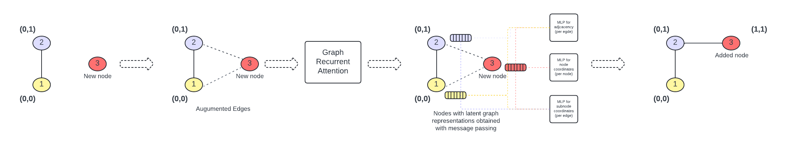

 # GRAN

This is the Pytorch reimplementation of [HDMapGen: A Hierarchical Graph Generative Model of High Definition Maps](https://arxiv.org/abs/2106.14880).

For detailed experiments please go to the following [project page](https://agshar96.github.io/HDMapGen_Reimplemented/)

## Visualization

### Model generation steps


## Dependencies
Python 3, PyTorch(1.2.0)

Other dependencies can be installed via 

  ```pip install -r requirements.txt```

## Important Config Variables
* max_num_nodes - This has to be set manually to highest number of nodes that can occur in a graph in training data. If not set correctly it leads to error in dataloader.
* has_stop_node - This has only be tested for graph with subnode prediction. It should still work for graphs without subnode prediction, but it might also fail.

Other config variables have self-explanatory names. 

To understand the code flow properly please use the file: config/gran_grid_small.yaml and set num_subgraph_batch to 1.

## Run Demo/Train/Test

### Demo
* The pretrained weights are inside the folder: exp/GRAN. There description is as follows
    * base_5 : Pretrained weights for network trained to generate only adjacency for 5x5 grid.
    * embed_5: Pretrained weights for network trained to generate adjacency and node coordinates.
    * subnode_5_noise: Pretrained weights for network with node and subnode and adjacency.
    * subnode_5_no_noise: Same as previous, but trained without noise based augmentation. Gives worse results.
    * GRANMixtureBernoulli_nuplan_2024-Mar-02-16-11-53_2285727: Weights for subset of nuplan dataset trained for 425 epochs.

* For running the demo, select the correct config then change the config variables ```test_model_dir``` and ```test_model_name```.

* To run the test of experiments ```X```

  ```python run_exp.py -c config/X.yaml -t```

### Train

* To run the training of experiment ```X``` where ```X``` is one of {```gran_subnode```, ```gran_nuplan```, ```gran_embed```, ```gran_grid_small```}:

  ```python run_exp.py -c config/X.yaml```

### Test

* After training, you can specify the ```test_model``` field of the configuration yaml file with the path of your best model snapshot, e.g.,

  ```test_model: exp/gran_grid/xxx/model_snapshot_best.pth```	

* To run the test of experiments ```X```:

  ```python run_exp.py -c config/X.yaml -t```


## Cite
To cite this reimplementation please use:
```
@misc{agshar96HDMapGenReimplementation,
	author = {},
	title = {{H}{D}{M}ap{G}en: {R}eimplementation and {E}xperiments --- agshar96.github.io},
	howpublished = {\url{https://agshar96.github.io/HDMapGen_Reimplemented/}},
	year = {2024},
}
```

## Acknowledgements

Our implementation extends the model described in the paper [GRAN](https://arxiv.org/abs/1910.00760). The code for the paper can be found [here](https://github.com/lrjconan/GRAN)
